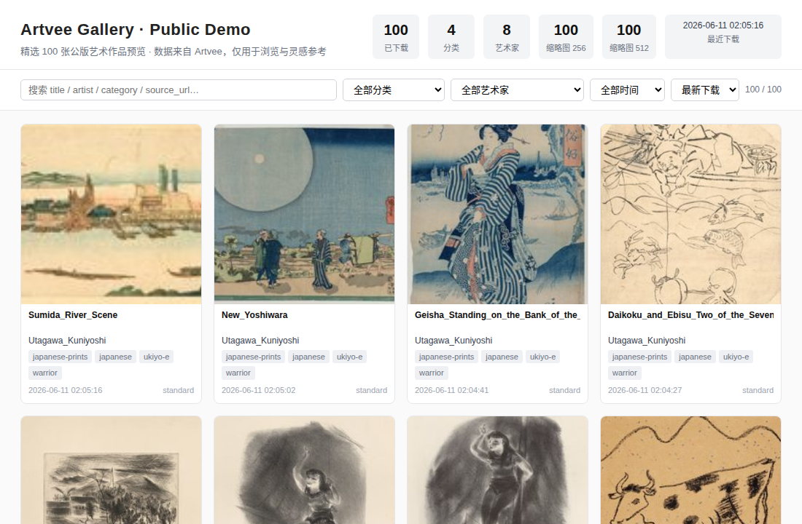
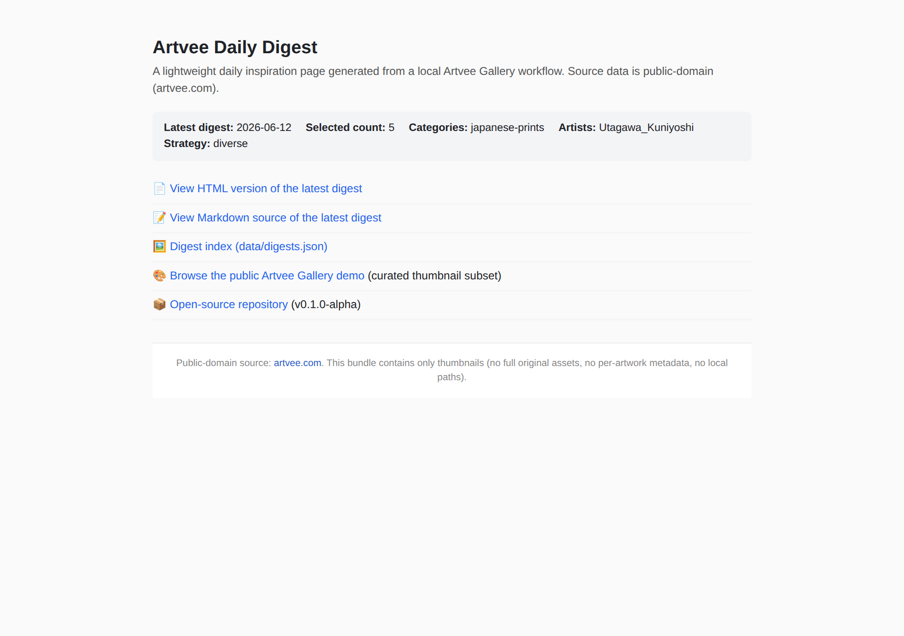

# Artvee Gallery

> A local-first Artvee library builder that turns collected public-domain art
> references into a browsable local gallery, lightweight public demo exports,
> and a daily inspiration digest.

[](https://github.com/conanxin/artvee-gallery/actions/workflows/open-source-ready.yml)
[](https://github.com/conanxin/artvee-gallery/releases/tag/v0.2.0)
[](LICENSE)
[](https://www.python.org/)
[](docs/RELEASE_NOTES_v0.2.0.md)

Latest release: **v0.2.0** (stable, 2026-06-16). See
[docs/RELEASE_NOTES_v0.2.0.md](docs/RELEASE_NOTES_v0.2.0.md)
and [CHANGELOG.md](CHANGELOG.md).
Previous pre-release: [v0.2.0-alpha](docs/RELEASE_NOTES_v0.2.0-alpha.md).

> **v0.2.1 release-prep (2026-07-05, appended with P9F+1 on 2026-07-11, P9G+2 on 2026-07-12):**
> CHANGELOG top section +
> [docs/RELEASE_NOTES_v0.2.1.md](docs/RELEASE_NOTES_v0.2.1.md)
> authored. **P9F+1** (`scripts/artvee_metrics.py` +
> `scripts/check_artvee_metrics.py` + [docs/METRICS_MODEL.md](docs/METRICS_MODEL.md))
> canonicalizes the metrics model so stale cached snapshots can never
> reappear silently; on 2026-07-12 live counts are
> `library_records=1306`, `manifest_downloaded=~1286`,
> `manifest_pending=54`, `manifest_failed=10`, `known_retired=4`.
> Public Gallery = 300 selected works; **P9G+2** shrinks the
> public bundle from 14.88 MB to **3.48 MB** by stopping the
> export of 512 thumbnails (Grid was using only 256 anyway); the
> bundle now records its `detail-thumb-policy` in
> `data/gallery_stats.json` and ships under the new
> [docs/PUBLIC_BUNDLE_POLICY.md](docs/PUBLIC_BUNDLE_POLICY.md)
> contract. Public Digest history = 9 entries.
> **No `v0.2.1` tag cut yet, no GitHub Release published
> yet** — pending user approval. **Observation window restarts
> from the P9G+2 commit** (2026-07-12).

> **v0.2.0 is the first stable daily-operable release.**
> 3-day observation window (2026-06-14 — 2026-06-16) closed green;
> stable-readiness assessment (P7F) 15/15 PASS — see
> [docs/STABLE_READINESS_v0.2.0.md](docs/STABLE_READINESS_v0.2.0.md)
> and the day-by-day log in
> [docs/V0_2_OBSERVATION_WINDOW.md](docs/V0_2_OBSERVATION_WINDOW.md).

> **v0.2.0 is the first stable daily-operable release.**
> 3-day observation window (2026-06-14 — 2026-06-16) closed green;
> stable-readiness assessment (P7F) 15/15 PASS — see
> [docs/STABLE_READINESS_v0.2.0.md](docs/STABLE_READINESS_v0.2.0.md)
> and the day-by-day log in
> [docs/V0_2_OBSERVATION_WINDOW.md](docs/V0_2_OBSERVATION_WINDOW.md).

## Live Demo

Two static, CDN-friendly exports are published on GitHub Pages:

- **Gallery demo** (curated thumbnail subset, ~5.7 MB):
  <https://conanxin.github.io/projects/artvee-gallery-demo/>
- **Daily digest** (latest 5-pick inspiration page, ~324 KB):
  <https://conanxin.github.io/projects/artvee-gallery-digest/>

Neither export contains the full local archive, the original image assets,
or any private metadata. See
[docs/OPEN_SOURCE_BOUNDARIES.md](docs/OPEN_SOURCE_BOUNDARIES.md) for the
full breakdown of what is — and is not — in this repository.

## What it does

- **Nightly Artvee batch collection** — `refill` + `batch` workflow that
  pulls a bounded set of public-domain works from artvee.com into a local
  archive with full provenance metadata.
- **Local gallery builder** — turn the archive into a structured
  `web/data/*.json` index plus 256/512 px thumbnails; serve a static
  browse UI from any HTTP server.
- **Public demo export** — emit a curated, CDN-friendly static bundle
  (`dist/`) suitable for GitHub Pages or any static host.
- **Daily inspiration digest** — automatically pick 5 representative
  works from the latest batch and render Markdown + HTML for archival,
  reading, and future publishing.
- **Telegram-friendly run summaries** — the nightly wrapper posts a
  compact Chinese-keyword summary (`统计 / 图库 / 灵感`) to Telegram
  after each run, via a pluggable notifier bridge.

## What is **not** included in this repository

- The full local image archive (`images/`)
- The full metadata archive (`metadata/`)
- Generated thumbnails (`thumbs/`)
- Runtime logs and wrapper run histories (`logs/`)
- The private machine path of any contributor
- Pre-built demos, digests, or any nightly-generated data

The repository is **code + docs + examples + readiness check** only.
All `data/` and `dist/` artifacts are rebuilt locally by the user.

## Architecture

```
              ┌─────────────────────────────────────────────┐
              │  External: artvee.com public-domain works   │
              └─────────────────────────────────────────────┘
                              │ scraped / batched
                              ▼
   ┌──────────────────────────────────────────────────────────────┐
   │  scripts/                                                    │
   │    scrape_artvee_seeds.py        → seeds candidate pool      │
   │    add_artvee_candidates.py      → expand manifest           │
   │    refill_artvee_pending.py      → top up pending queue      │
   │    run_artvee_nightly_batch.py   → download + parse + index  │
   │    artvee_nightly_wrapper.sh     → orchestrate the 3 stages  │
   └──────────────────────────────────────────────────────────────┘
                              │ images/, metadata/
                              ▼
   ┌──────────────────────────────────────────────────────────────┐
   │  scripts/build_artvee_gallery.py                             │
   │    → thumbs/{256,512}/*.jpg                                  │
   │    → web/data/artworks.json                                  │
   │    → web/data/gallery_stats.json                             │
   └──────────────────────────────────────────────────────────────┘
            │                                   │
            ▼                                   ▼
  ┌───────────────────────┐          ┌────────────────────────────────┐
  │  web/ (local UI)      │          │ scripts/export_artvee_gallery_ │
  │  index.html, app.js   │          │   public_demo.py               │
  │  style.css            │          │   → dist/ (curated, static)    │
  │  data/*.json          │          │   (deployable to any host)     │
  └───────────────────────┘          └────────────────────────────────┘
            │
            ▼
  ┌────────────────────────────────────┐
  │ scripts/build_artvee_daily_digest.py│
  │   → digests/artvee-digest-*.md     │
  │   → digests/artvee-digest-*.html   │
  │   → web/data/digests.json          │
  └────────────────────────────────────┘
            │
            ▼
  ┌────────────────────────────────────┐
  │ scripts/artvee_telegram_notify.py  │
  │   (optional) summary to Telegram   │
  └────────────────────────────────────┘
```

The nightly wrapper (`scripts/artvee_nightly_wrapper.sh batch`) chains
**refill → batch → gallery rebuild → digest build → Telegram notify**
in one cron-friendly invocation. See
[docs/ARCHITECTURE.md](docs/ARCHITECTURE.md) for the full data flow.

## Quick Start

This is a **local-first** project. You start with the code, then the
code generates everything else in your own working copy.

### Prerequisites

- Python 3.9 or newer
- (Optional) `Pillow` for thumbnail generation and dominant-palette
  extraction in the digest builder
- (Optional) A static HTTP server of choice (`python3 -m http.server`,
  `nginx`, GitHub Pages, etc.) for serving the local UI

### Build the local gallery (after you have `images/`, `metadata/`, `index/`)

```bash
# from the repo root
python3 scripts/build_artvee_gallery.py --mode local
bash scripts/serve_artvee_gallery.sh          # serves web/ on :8000
```

### Export a curated public demo bundle

```bash
python3 scripts/export_artvee_gallery_public_demo.py \
    --limit 100 --strategy diverse \
    --out-dir dist/artvee-gallery-public-demo
```

The `dist/` output is a self-contained static bundle; deploy it to
GitHub Pages, Netlify, an S3 bucket, or any static host.

### Generate a daily inspiration digest

```bash
python3 scripts/build_artvee_daily_digest.py \
    --strategy diverse --select 5 --candidate-limit 20
```

This writes `digests/artvee-digest-YYYY-MM-DD.{md,html}` and updates
the rolling index `web/data/digests.json`.

### (Optional) Wire up the nightly wrapper

The wrapper script is **path-agnostic** — it derives its base directory
from its own location, so you can `git clone` anywhere.

```bash
# add to crontab (machine-local, example)
0 2 * * * cd <path-to-clone> && bash scripts/artvee_nightly_wrapper.sh batch
30 1 * * * cd <path-to-clone> && bash scripts/artvee_nightly_wrapper.sh refill
```

You can override the Python interpreter:

```bash
ARTVEE_PYTHON=python3.11 bash scripts/artvee_nightly_wrapper.sh batch
```

## Directory Layout

```
artvee-library/
├── README.md                    ← you are here
├── LICENSE                      ← MIT
├── .gitignore                   ← generic ignore rules
│
├── docs/                        ← documentation
│   ├── ARCHITECTURE.md
│   ├── OPEN_SOURCE_BOUNDARIES.md
│   ├── ROADMAP.md
│   ├── DEVELOPMENT.md
│   ├── PROJECT_STATUS.md
│   ├── RELEASE_NOTES_v0.1.0-alpha.md
│   ├── GALLERY_DATA_SCHEMA.md
│   ├── GALLERY_LOCAL_USAGE.md
│   ├── GALLERY_PUBLIC_DEMO.md
│   └── GALLERY_DAILY_DIGEST.md
│
├── scripts/                     ← executable code
│   ├── build_artvee_gallery.py
│   ├── export_artvee_gallery_public_demo.py
│   ├── build_artvee_daily_digest.py
│   ├── artvee_nightly_wrapper.sh
│   ├── artvee_telegram_notify.py
│   └── check_open_source_ready.py
│
├── web/                         ← local UI (static)
│   ├── index.html
│   ├── app.js
│   ├── style.css
│   └── data/.gitkeep            ← generated JSON lives here
│
├── examples/                    ← tiny synthetic sample data
│   ├── artworks.sample.json
│   ├── gallery_stats.sample.json
│   └── digest.sample.json
│
├── dist/.gitkeep                ← public demo bundles (regenerated)
├── thumbs/{256,512}/.gitkeep    ← thumbnails (regenerated)
└── digests/.gitkeep             ← daily digests (regenerated)
```

> Paths shown above as `<dir>/` are *intentionally* gitignored — they
> are produced locally by the scripts in `scripts/`. See
> [docs/OPEN_SOURCE_BOUNDARIES.md](docs/OPEN_SOURCE_BOUNDARIES.md).

## Data Boundaries

This repository is intentionally **read-only-data-only**. The
following are tracked:

- Source code (`.py`, `.sh`)
- Documentation (`.md`)
- Public web UI shell (`web/index.html`, `web/app.js`, `web/style.css`)
- Tiny sample data (`examples/*.json`)
- Placeholder files (`.gitkeep`)

The following are **never** tracked (see `.gitignore`):

- `images/`, `metadata/`, `previews/` — the source archive
- `thumbs/` — generated thumbnails
- `web/data/*.json` — generated indices
- `dist/` — generated public demo bundles
- `digests/` — generated daily digests
- `inbox/`, `index/`, `logs/`, `backups/` — local staging / runtime

For the full rationale and a risk surface, see
[docs/OPEN_SOURCE_BOUNDARIES.md](docs/OPEN_SOURCE_BOUNDARIES.md).

## Documentation

| Document | What it covers |
| --- | --- |
| [docs/RELEASE_NOTES_v0.2.0-alpha.md](docs/RELEASE_NOTES_v0.2.0-alpha.md) | v0.2.0-alpha release notes |
| [docs/RELEASE_NOTES_v0.2.1.md](docs/RELEASE_NOTES_v0.2.1.md) | v0.2.1 release notes (release-prep, not yet tagged) |
| [CHANGELOG.md](CHANGELOG.md) | Aggregated changelog across versions |
| [docs/METRICS_MODEL.md](docs/METRICS_MODEL.md) | **Canonical metrics schema (`artvee-metrics-v1`)** + freshness rule (P9F+1) |
| [docs/ARCHITECTURE.md](docs/ARCHITECTURE.md) | Data flow, script responsibilities, generated-vs-tracked boundary |
| [docs/OPEN_SOURCE_BOUNDARIES.md](docs/OPEN_SOURCE_BOUNDARIES.md) | What is and is not in this repository, and why |
| [docs/ROADMAP.md](docs/ROADMAP.md) | Past phases, near-term, mid-term, long-term |
| [docs/DEVELOPMENT.md](docs/DEVELOPMENT.md) | Local dev loop, syntax checks, readiness check, what **not** to run |
| [docs/PROJECT_STATUS.md](docs/PROJECT_STATUS.md) | Current phase markers and last-known-good snapshot |
| [docs/DAILY_OPERATING_PLAYBOOK.md](docs/DAILY_OPERATING_PLAYBOOK.md) | Daily operating timeline, commands, failure playbook, quick reference |
| [docs/POST_STABLE_OPERATIONS.md](docs/POST_STABLE_OPERATIONS.md) | Post-stable ops status command (one-shot health aggregator) |
| [docs/DIGEST_HISTORY.md](docs/DIGEST_HISTORY.md) | 30-day digest history and near-dup-aware selection |
| [docs/NEAR_DUPLICATE_REVIEW.md](docs/NEAR_DUPLICATE_REVIEW.md) | Near-duplicate review workflow |
| [docs/GALLERY_DATA_SCHEMA.md](docs/GALLERY_DATA_SCHEMA.md) | Field-level schema for `web/data/*.json` |
| [docs/GALLERY_LOCAL_USAGE.md](docs/GALLERY_LOCAL_USAGE.md) | Local gallery usage and serving |
| [docs/GALLERY_PUBLIC_DEMO.md](docs/GALLERY_PUBLIC_DEMO.md) | Public demo export internals |
| [docs/GALLERY_DAILY_DIGEST.md](docs/GALLERY_DAILY_DIGEST.md) | Daily digest selection strategies and outputs |
| [docs/PUBLIC_DEMO_REFRESH_PLAN.md](docs/PUBLIC_DEMO_REFRESH_PLAN.md) | Public demo refresh modes (manual / semi-auto / full-auto) |
| [docs/PUBLIC_BUNDLE_POLICY.md](docs/PUBLIC_BUNDLE_POLICY.md) | Public bundle contract: what the public Gallery ships and why |
| [docs/RELEASE_NOTES_v0.1.0-alpha.md](docs/RELEASE_NOTES_v0.1.0-alpha.md) | v0.1.0-alpha release notes (previous) |

## Current operational model

A single host runs four cron jobs in `Asia/Shanghai`; everything
else is local and offline. The Telegram delivery is opt-in and
non-fatal — a failure of the MEDIA track cannot fail the daily
health check.

| Time | Job | What it does |
| --- | --- | --- |
| 01:30 | `artvee_nightly_wrapper.sh refill` | Pull a bounded set of public-domain works |
| 02:00 | `artvee_nightly_wrapper.sh batch` | Run the nightly batch on the local archive |
| 02:30 | `confirm_demo_refresh.sh --no-telegram` | Build the public-demo candidate bundle |
| 03:00 | `artvee_daily_health_check.sh --online --media` | Send the daily health report to Telegram |
| manual | `publish_demo_refresh_candidate.sh --approve` | Push the approved bundle to GitHub Pages |

Refill and batch are the only jobs that touch the network. The
publish step is always manual — there is no auto-publish cron.

## Roadmap

- ✅ **P1** Local gallery browser
- ✅ **P2** Public demo export
- ✅ **P3A–P3F** Public GitHub repo, CI, digest page, case study
- ✅ **P4A–P4E** Filename collision healing, status split, CDN wait
- ✅ **P5A–P5F** Content healing, visual QA, curation filters
- ✅ **P6A–P6G** Telegram MEDIA staging, KNOWN_RETIRED, near-dup review, 30-day digest, approved publish
- ✅ **P7A–P7B+1** Daily health check, Telegram cron, MEDIA failure-only fallback
- ✅ **P7D** v0.2.0-alpha release consolidation
- ✅ **P8A–P8E** post-stable ops polish, public-demo cards/filters, 03:10 media-replay cron + queue truthfulness + dry-run isolation (P8A, P8A+1, P8B, P8C, P8D, P8D+1, P8D+2, P8D+3, P8D+4, P8D+4B, P8D+4C, P8E — see [docs/PROJECT_STATUS.md](docs/PROJECT_STATUS.md))
- 🔜 **v0.2.1 release-prep** — `docs/RELEASE_NOTES_v0.2.1.md` authored; tag + GitHub Release pending user approval after 7-day observation
- ✅ **v0.2.0 stable** — released 2026-06-16; latest stable public release (tag `v0.2.0`)
- 🔜 **P3D** (legacy roadmap) has been superseded by P7D; the standalone public GitHub repository is the same as this one.
- 🔜 **P3E** Public daily-digest page

For the long view, see [docs/ROADMAP.md](docs/ROADMAP.md).

## Contributing

Open an issue or a pull request against the standalone public
repository (see [docs/ROADMAP.md](docs/ROADMAP.md) for the publish
plan). Local forks are welcome; please keep generated data out of
commits — `scripts/check_open_source_ready.py` is your friend.

## Documentation

- [docs/RELEASE_NOTES_v0.2.0-alpha.md](docs/RELEASE_NOTES_v0.2.0-alpha.md) — v0.2.0-alpha release notes
- [docs/RELEASE_NOTES_v0.2.1.md](docs/RELEASE_NOTES_v0.2.1.md) — v0.2.1 release notes (release-prep)
- [CHANGELOG.md](CHANGELOG.md) — aggregated changelog across versions
- [docs/ARCHITECTURE.md](docs/ARCHITECTURE.md) — technical deep-dive
- [docs/DEVELOPMENT.md](docs/DEVELOPMENT.md) — local setup, scripts, conventions
- [docs/OPEN_SOURCE_BOUNDARIES.md](docs/OPEN_SOURCE_BOUNDARIES.md) — what is in / out of this repo
- [docs/ROADMAP.md](docs/ROADMAP.md) — phase plan and what's next
- [docs/PROJECT_STATUS.md](docs/PROJECT_STATUS.md) — phase markers and last-known-good
- [docs/DAILY_OPERATING_PLAYBOOK.md](docs/DAILY_OPERATING_PLAYBOOK.md) — daily operating timeline + commands
- [docs/DIGEST_HISTORY.md](docs/DIGEST_HISTORY.md) — 30-day digest history
- [docs/NEAR_DUPLICATE_REVIEW.md](docs/NEAR_DUPLICATE_REVIEW.md) — near-dup review workflow
- [docs/GALLERY_LOCAL_USAGE.md](docs/GALLERY_LOCAL_USAGE.md) — local gallery walkthrough
- [docs/GALLERY_PUBLIC_DEMO.md](docs/GALLERY_PUBLIC_DEMO.md) — public demo walkthrough
- [docs/GALLERY_DAILY_DIGEST.md](docs/GALLERY_DAILY_DIGEST.md) — daily digest walkthrough
- [docs/GALLERY_DATA_SCHEMA.md](docs/GALLERY_DATA_SCHEMA.md) — JSON shape reference
- [docs/GALLERY_PUBLISHING_PLAN.md](docs/GALLERY_PUBLISHING_PLAN.md) — public publishing plan
- [docs/RELEASE_NOTES_v0.1.0-alpha.md](docs/RELEASE_NOTES_v0.1.0-alpha.md) — v0.1.0-alpha release notes (previous)

## Project story

- [docs/CASE_STUDY.md](docs/CASE_STUDY.md) — how a one-off nightly downloader became a public, open-source visual archive
- [docs/RETROSPECTIVE.md](docs/RETROSPECTIVE.md) — phase-by-phase lessons, impact analysis, and open questions
- [docs/LOCAL_FIRST_AGENT_PROJECT_PATTERN.md](docs/LOCAL_FIRST_AGENT_PROJECT_PATTERN.md) — the reusable methodology extracted from this project

## Screenshots

### Gallery demo



A static subset of 300 curated thumbnails across 4 categories. Served
from <https://conanxin.github.io/projects/artvee-gallery-demo/>
(record count live-verified 2026-07-05; was 100 prior to the
v0.2.1-era `--gallery-limit` parameter; v0.2.1 release-prep
documentation lives in
[docs/RELEASE_NOTES_v0.2.1.md](docs/RELEASE_NOTES_v0.2.1.md)).

> **P9G+2 (2026-07-12):** the public bundle now ships **256
> thumbnails only** (3.48 MB total, down from 14.88 MB). The
> 512 thumbnails are no longer part of the public bundle and the
> detail panel falls back to the 256 thumb cleanly under
> `detail-thumb-policy=none`. See
> [docs/PUBLIC_BUNDLE_POLICY.md](docs/PUBLIC_BUNDLE_POLICY.md).

### Daily digest demo



The latest 5-pick daily inspiration digest. Served from
<https://conanxin.github.io/projects/artvee-gallery-digest/>.

## License

[MIT](LICENSE) — see `LICENSE` for the full text.

## Acknowledgements

- Data source: [artvee.com](https://artvee.com) — public-domain art
  curated by the Artvee team.
- All works archived by this tool are public-domain in their country
  of origin; users are responsible for verifying the licensing status
  of any individual work before redistribution.
